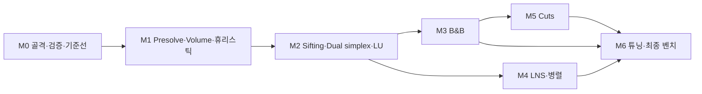

# SPP Solver — 구현 순서 계획

개정 3 (2026-09-07). 마일스톤, 작업 분해, 의존성, 완료 게이트, 리스크와 트리거, 파라미터 기본값을 다룬다. 설계 내용은 01·02를 참조한다.

## 1. 순서 원칙

1. **검증 장치가 알고리즘보다 먼저.** `Verifier`, 최적값 표, `BoundGuard`를 M0~M1에 둔다. 틀린 하한은 조용히 이기는 척하기 때문이다(01 §8).
2. **지표에 가장 결정적인 부품을 앞에.** `t_proof` 집계의 대부분은 nw 계열 root LP 증명에서 나온다. 정밀 LP(sifting + dual simplex)를 M2로 앞당긴다.
3. **각 마일스톤은 동작하는 솔버를 남긴다.** Stage A(Volume)만으로도 feasible 해와 유효 하한을 내는 상태를 M1에서 만들고, 이후 부품은 그 위에 얹는다.
4. **조건부 항목은 트리거를 명시한다.** Cuts(M5)와 병렬 B&B(M4 옵션)는 앞 단계 결과가 조건을 만족할 때만 착수한다(§5).
5. **벤치는 매 마일스톤 끝에 같은 스크립트로 반복한다.** 성능 회귀를 마일스톤 단위로 잡는다(01 §9).

## 2. 마일스톤 개요

| # | 산출물 | 완료 기준 |
|---|---|---|
| M0 | 골격, byte 파서, `Instance`, `Verifier`, `data/optima.csv`, 기준선 스크립트(내부 시간·모델 생성 시간 분리) | 55개 전부 파싱(us01 ≤ 2 s), 기준선 표 생성, 기준선이 알려진 최적값 재현 |
| M1 | Presolve(행 지배 포함) + Volume + GreedyRC/LagrangianRepair + `BoundGuard` | 모든 인스턴스에서 feasible 해, `LB_L ≤ 최적값` 전부 통과, nw 계열 대부분 gap < 1% |
| M2 | Sifting + bounded dual simplex(희소 LU) + 정확 감소비용 고정 + LpDive + 외부 LP 대조 | `z_LP`가 Glop과 55개 전부 일치, root에서 nw 계열 다수 증명 |
| M3 | B&B(Ryan–Foster bound 변경, plunge + best-bound) + 노드 presolve | 증명 개수 ≥ SCIP(쌍 A), nw·kl·us 계열 전부 증명. aa 계열 실패 시 M5 트리거 |
| M4 | LNS + ExactRepair + 병렬 포트폴리오(옵션: 병렬 B&B) | `opt` 도달 개수 ≥ CP-SAT 60 s(쌍 B) |
| M5 | Clique cut → odd-cycle cut, CutPool | aa 계열 노드 수 감소, 증명 개수 목표 달성 |
| M6 | 튜닝: dual steepest edge, bound flipping ratio test, 분기 쌍 선택, 이웃 전략 적응, JVM 효과 대응 | `t_proof` shifted geomean < 기준선(두 쌍 모두), 최종 벤치 표 |

## 3. 마일스톤별 작업 분해와 완료 게이트

작업 항목의 참조는 해당 설계 절이다. 규모는 상대 표기(소·중·대).

### M0 — 골격과 검증 기반

| 작업 | 규모 | 참조 |
|---|---|---|
| Gradle(Kotlin DSL) 프로젝트, 패키지 골격, `jar` 태스크 | 소 | 01 §1, §11 |
| `OrLibReader` byte 파서 + 입력 검증 + 오류 파일 테스트 | 중 | 01 §4.1 |
| `Instance`(CSC, 행 차수, 행 bitset), `Solution`, `SolveContext` | 소 | 01 §3 |
| `Verifier` | 소 | 01 §8 |
| `OptimaTable`, `data/optima.csv` 작성(출처 대조), `data/solutions/` 초기본(SCIP 결과) | 중 | 01 §4.3 |
| `MpsWriter` | 소 | 01 §4.2 |
| `ortools_cpsat.py`, `ortools_scip.py`(내부 시간·모델 생성 시간 분리), `Runner`, `compare.py`, 결과 JSON 스키마 | 중 | 01 §4.4, §9 |
| 기준선 1차 수집(두 쌍, 60 s, 5회) | 실행 | 01 §9.2 |

게이트: 55개 파싱 성공과 us01 ≤ 2 s. 기준선 표가 생성되고 기준선의 최적해가 `Verifier`와 최적값 표를 통과한다.

### M1 — Presolve, Volume, 1차 휴리스틱

| 작업 | 규모 | 참조 |
|---|---|---|
| `Reducer` 규칙 1~5, 고정점 반복, `PresolveMap`, 규칙별 단위 테스트 | 중 | 02 §2 |
| Presolve 전/후 IP 최적값 일치 확인(소형 인스턴스, SCIP) | 소 | 01 §8 |
| `Volume`(종료 조건, 데드라인 체크) | 중 | 02 §3 |
| `ReducedCostFixer`(라그랑지안 쌍대, 정수 강화, x_j=1 고정) | 소 | 02 §4 |
| `GreedyRC`, `LagrangianRepair` | 소 | 02 §6 |
| `BoundGuard`(전역 LB 단언, 최적해 추적의 root 부분) | 소 | 01 §8 |
| `Solver` 파이프라인 1~4, 9 + `Deadline` + 결과 JSON | 중 | 01 §2, §5 |

게이트: 55개 전부 feasible 해와 `Verifier` 통과. `LB_L ≤ 최적값` 전부 통과. nw 계열 대부분 gap < 1%. 결정론 모드 로그 재현.

### M2 — 정밀 LP

| 작업 | 규모 | 참조 |
|---|---|---|
| `Basis`, `DenseLU`(m ≤ 150), `SparseLU`(Markowitz + Forrest–Tomlin, 재인수분해 정책), 랜덤 행렬 재구성 테스트 | 대 | 02 §5.6 |
| `DualSimplex`: bounded, revised, 인공변수 시작 기저, Harris 비율 검사, perturbation, 불가능 판정, bound 변경 API, 행 추가 API | 대 | 02 §5.1~5.3, §5.5 |
| 소형 LP 대 brute force / 알려진 해 테스트 | 소 | 01 §10 |
| `Sifter`(초기 core, pricing, 상한 1 배치, 수렴 판정, `L(y)` fallback) | 중 | 02 §5.4 |
| `ReducedCostFixer` LP 쌍대 경로 + 고정-재LP 루프 | 소 | 02 §4, §5.4 |
| `LpDive` | 소 | 02 §6 |
| `CoreInstance`(CSR, `ColumnMask`) 생성 | 소 | 01 §3 |
| `rootlp_glop.py`, `data/rootlp.csv`, 대조 회귀 테스트 | 소 | 01 §8 |
| `Solver` 파이프라인 5~6 | 소 | 01 §2 |

게이트: `z_LP`가 Glop과 55개 전부 상대 오차 1e-6 이내. root에서 `LB ≥ UB`로 증명되는 nw 계열 인스턴스 수를 기록하고 SCIP의 root 증명 수와 비교. sifting 라운드 수와 core 크기 로그.

### M3 — Branch & Bound

| 작업 | 규모 | 참조 |
|---|---|---|
| `Node`(bound 델타, 기저 저장·복원), `NodeQueue`(best-bound + plunge), 전역 LB | 중 | 02 §7.2 |
| `RyanFoster` 쌍 선택, 좌·우 bound 변경, 보조 변수 분기 | 소 | 02 §7.1 |
| `BranchAndBound` 노드 처리 순서, 정수해 검증·갱신 | 중 | 02 §7.3 |
| `NodePresolve`(단일열 행, 행 지배, 빈 행) | 소 | 02 §7.3 |
| `BoundGuard` 노드 수준 최적해 추적 | 소 | 01 §8 |
| 점프·재인수분해·노드 카운터 로그 | 소 | 01 §4.4 |

게이트: 쌍 A에서 증명 개수 ≥ SCIP. nw·kl·us 계열 전부 증명. 55개 회귀 테스트(`slowTest`) 통과.
**트리거 판정**: aa 계열 중 60 s 안에 증명하지 못한 인스턴스가 있고 노드 수가 수만을 넘으면 M5를 M4보다 먼저 착수한다.

### M4 — LNS와 병렬 포트폴리오

| 작업 | 규모 | 참조 |
|---|---|---|
| `ExactRepair`(DFS, 가지치기, 상태 상한), brute force 대조 테스트 | 중 | 02 §6-4 |
| `Lns` 이웃 전략 5종, k 적응, 고정 열 제외 | 중 | 02 §6-5 |
| `Portfolio`, `SharedIncumbent`, 워커 생명주기, 종료 신호 | 중 | 01 §6 |
| 결정론 모드의 LNS 라운드로빈 삽입 | 소 | 01 §6, 02 §9 |
| (옵션) `ParallelTree`: 워커별 LP, 공유 큐, 전역 LB 정의 | 대 | 01 §6, 02 §9 |

게이트: 쌍 B에서 `opt` 도달 개수 ≥ CP-SAT. 결정론 모드 재현 유지.
**옵션 판정**: M3 결과에서 aa 계열의 병목이 트리 탐색 시간이면 `ParallelTree`를 켠다. 병목이 LP 자체이면 M6의 LP 튜닝을 앞당긴다.

### M5 — Cuts (조건부)

| 작업 | 규모 | 참조 |
|---|---|---|
| `CliqueSeparator`(support 그래프, x 가중 greedy, 행 포함 클리크 제외) | 중 | 02 §8 |
| `OddCycleSeparator`(이분 복제 그래프 최단경로) | 중 | 02 §8 |
| `CutPool`, `DualSimplex` 행 추가·제거, 재인수분해 시 비활성 제거 | 중 | 02 §5.3, §8 |
| root R라운드, 깊이 ≤ d 적용 정책 | 소 | 02 §7.3 |

게이트: aa 계열 노드 수가 M3 대비 유의하게 감소하고 증명 개수 목표(M3 게이트)를 달성한다. cut 추가 후에도 `BoundGuard` 전부 통과(cut의 유효성 검증).

### M6 — 튜닝과 최종 벤치

| 작업 | 규모 | 참조 |
|---|---|---|
| Dual steepest edge 가격 | 중 | 02 §5.5 |
| Bound flipping ratio test | 중 | 02 §5.5 |
| 분기 쌍 선택 튜닝(0.5 근접 외 후보: 쌍대 가중, 이력) | 소 | 02 §7.1 |
| 이웃 전략 적응(성공률 기반 가중) | 소 | 02 §6-5 |
| JVM 효과 대응: cold/warm 결과 분석, 필요 시 AppCDS 또는 GraalVM native-image 검토 | 중 | 01 §9.3 |
| 최종 벤치(두 쌍, 5회 중앙값, cold/warm), 패배 인스턴스 프로파일, 보고서 | 실행 | 01 §9 |

게이트: 두 쌍 모두에서 01 §9.4의 승리 조건 셋을 만족한다. 전체 표와 환경 정보를 `results/`에 남긴다.

## 4. 의존성

- M4의 `ExactRepair`와 `Lns`는 M1 직후에도 착수 가능하다(마스크와 감소비용만 필요). 병렬 포트폴리오 통합은 M3의 B&B가 있어야 의미가 있다.
- M5는 M3의 트리거 판정 결과에 따라 M4보다 앞설 수 있다.
- `DualSimplex`와 `SparseLU`(M2)가 전체 일정의 임계 경로다. 이 둘이 늦으면 M3 이후가 전부 밀린다.

## 5. 리스크와 대응

| 리스크 | 대응 | 트리거·판정 |
|---|---|---|
| **틀린 하한으로 거짓 최적 증명** | 01 §8 전부. `Verifier` 상시, `BoundGuard` 최적해 추적, Glop LP 대조, 55개 회귀 테스트 | 모든 마일스톤 게이트에 포함 |
| 자체 dual simplex의 수치 불안정과 구현 공수(최대 리스크) | 단일 알고리즘으로 통일(primal 없음). Harris + perturbation. Stage A만으로 동작하는 fallback 유지. M2에서 Glop 대조로 조기 검출 | M2 게이트 실패 시 Glop 대조로 불일치 인스턴스부터 디버그 |
| Dense LU를 노드에서 쓰면 점프마다 0.1~0.3 s | 희소 LU 기본, dense는 m ≤ 150 한정. plunge 우선으로 점프 자체를 줄임 | `jumps × refactor 시간`이 `t_solve`의 20%를 넘으면 재인수분해 정책 조정 |
| core가 커서 Stage B가 감당 못 함 | sifting은 core 크기 가정에 의존하지 않음. 라운드당 추가 열 상한 2m. 시간 예산 초과 시 `L(y)` 하한 | sifting 라운드 수와 core 크기 로그로 관찰 |
| aa 계열 트리 폭발 | Ryan–Foster + 강한 고정 + LNS 조기 incumbent. 실패 시 M5 clique cut 즉시 착수. 병렬 B&B 옵션 | M3 게이트의 트리거 판정 |
| us01(1M열) 메모리·시간 | CSC + 행 bitset만 전체 열에, 마스크·CSR은 core만. byte 파서. Volume·pricing은 O(nnz) 스트리밍. 지배 열 규칙 생략 | M0 파싱 게이트, M1 메모리 측정 |
| "이겼다"는 판정의 신뢰성 | 01 §9: 내부 시간 1차, 비교 쌍 분리, shifted geomean + PAR-2 사전 고정, cold/warm 분리, 5회 중앙값, 전체 표 공개 | 지표 정의는 M0에서 확정하고 이후 변경 금지 |
| JIT 미완료 실행이 nw 계열 결과를 지배 | cold/warm 둘 다 보고. 필요 시 AppCDS 또는 native-image | M6에서 cold와 warm 차이가 shifted geomean에 유의하면 검토 |

## 6. 파라미터 기본값

코드에서는 한 곳(`Params`)에 모으고 CLI로 덮어쓸 수 있게 한다. 값은 M6 튜닝 전의 출발점이다.

| 파라미터 | 기본값 | 참조 |
|---|---|---|
| 시간 예산 비율: presolve / Volume / 초기 휴리스틱 / root LP | 2% / 8% / 2% / 30% | 01 §5 |
| Volume 반복 상한 / 무개선 종료 | 500 / 50회 | 02 §3 |
| 지배 열 규칙 행 차수 상한 D | 5,000 | 02 §2 |
| Sifting 초기 core: 행당 상위 k열 / 감소비용 임계 τ / core 상한 | 10 / 0 / 20m | 02 §5.4 |
| Sifting 라운드당 추가 열 상한 / pricing 임계 ε_price | 2m / 1e-7 | 02 §5.4 |
| 고정-재LP 루프 상한 | 3회 | 02 §5.4 |
| LP 허용오차 primal·dual / pivot | 1e-9 / 1e-7 | 02 §5.5 |
| 데드라인 체크 간격(simplex) | 100 pivot | 01 §5 |
| LU 업데이트 상한(재인수분해) / dense LU 허용 m | 100 / ≤ 150 | 02 §5.6 |
| ExactRepair 상태 상한 / 목표 \|R\| | 1e5 / 40~60 | 02 §6 |
| LNS 초기 k | 6 | 02 §6 |
| 보조 변수 분기 임계(`max x_j`) | 0.9 | 02 §7.1 |
| 노드 presolve 반복 상한 | 2회 | 02 §7.3 |
| Cut: root 라운드 R / 적용 깊이 d | 10 / 3 | 02 §8 |
| 병렬 B&B 워커 수(옵션 활성 시) | 2 | 01 §6 |

## 7. 미결 사항

- 쌍대 가격을 Dantzig에서 dual steepest edge로 바꾸는 시점. M2 게이트에서 pivot 수가 과다하면 M6 이전에 앞당긴다.
- 병렬 B&B 채택 여부. M3 결과에서 aa 계열 병목이 트리 탐색인지 LP인지에 따라 결정(§3 M4).
- cut 적용 깊이 d와 root 라운드 R. M5 실측으로 정한다.
- JVM 효과 대응 수단. cold/warm 차이가 유의할 때 AppCDS와 GraalVM native-image 중 선택. native-image는 "순수 Java" 제약과 충돌하지 않으나 빌드 파이프라인이 늘어난다.
- Volume 대신 단순 subgradient로 축소할지. Volume의 `x̄`가 휴리스틱과 분기에 기여하지 않으면 단순화한다.
- 알려진 최적값 표에서 출처 간 불일치가 나오는 인스턴스의 처리(SCIP 장시간 실행 시간 한도).
