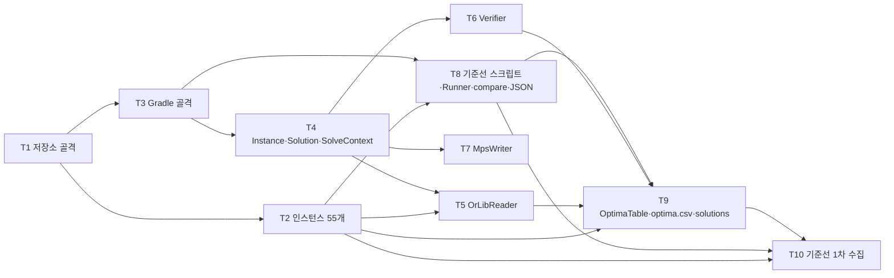

# M0 계획 — 골격과 검증 기반

- 작성: 2026-09-07, doc-checker(모드 A)
- 근거 문서: `00 §1~§5`, `03 §1`(순서 원칙), `03 §2`(M0 완료 기준), `03 §3` M0 표·게이트, `03 §4`, `03 §5`, `03 §6`, 그리고 M0 표가 참조하는 `01 §1, §2, §3, §4.1~§4.4, §8, §9, §10, §11`
- `02`는 M0 표에서 참조되지 않는다.

## 1. 목표(03 §2 M0)

산출물: 골격, byte 파서, `Instance`, `Verifier`, `data/optima.csv`, 기준선 스크립트(내부 시간·모델 생성 시간 분리).
완료 기준: 55개 전부 파싱(us01 ≤ 2 s), 기준선 표 생성, 기준선이 알려진 최적값 재현.

## 2. 저장소 현황(2026-09-07, `git ls-files` / `ls`)

| 항목 | 상태 |
|---|---|
| `docs/00~03`, `docs/archive/` | 있음 |
| `.gitignore` | 있음. `.claude/settings.local.json` 1항목만 |
| `src/`, `bench/`, `data/`, `results/` | 없음 |
| Gradle 파일(`build.gradle.kts`, `settings.gradle.kts`, `gradlew*`) | 없음. 시스템 Gradle 9.7.1(preflight) |
| `data/instances/` | 없음. 0/55 |
| Python `ortools` | 미설치. Python 3.14.5(휠 호환 확인 필요, preflight) |

## 3. 작업 목록(위상 정렬)

표 행(03 §3 M0)은 그대로 작업 하나. 표에 없는 선행 작업은 T1, T2로 추가했다. 규모는 03 §3 표기를 유지하고 추가 작업은 `소`.

| id | 작업 | 종류 | 규모 | 참조 | 의존 | 요약 |
|---|---|---|---|---|---|---|
| M0-T1 | 저장소 골격과 `.gitignore` | data | 소 | 01 §11, 01 §4.1, CLAUDE.md | — | **표 외 추가.** 01 §11 저장소 구성 디렉터리(`src/main/java/spp`, `src/test/java/spp`, `bench/scripts`, `data/instances`, `data/solutions`, `data/cache`, `results`)를 만든다. `.gitignore`에 빌드 산출물(`build/`, `.gradle/`)과 `data/instances/`, `data/cache/`(01 §4.1·§11 "VCS 제외"), `results/`를 추가한다(CLAUDE.md "큰 데이터와 빌드 산출물은 커밋하지 않는다"). 근거: T3 이후 모든 작업이 이 경로를 전제. 기존: `.gitignore`(1항목), `docs/` |
| M0-T2 | OR-Library 인스턴스 55개 확보 | data | 소 | 00 §1, 00 §2, 01 §11 | T1 | **표 외 추가.** nw01–43, aa01–06, kl01–02, us01–04 = 55개를 `data/instances/spp<name>.txt`로 배치(01 §11 파일명 패턴). 첫 줄 `rows cols` 포맷 확인(00 §2). 커밋 대상이 아니므로 재현 가능한 확보 절차(스크립트 또는 문서화된 명령)를 남긴다. 근거: 03 §3 M0 게이트 "55개 파싱 성공과 us01 ≤ 2 s"와 01 §9.2 기준선 수집이 파일 존재를 전제. 출처 URL은 문서에 없음 → 스펙 openQuestion. 기존: 없음(0/55) |
| M0-T3 | Gradle(Kotlin DSL) 프로젝트, 패키지 골격, `jar` 태스크 | code | 소 | 01 §1, 01 §11, 01 §10 | T1 | Java 21, 외부 런타임 의존성 없음, 테스트만 JUnit 5(01 §11). 태스크 `run`, `test`, `slowTest`, `bench`, `jar`(단일 실행 jar). 패키지 골격 `spp.{io, model, presolve, bound, bound.lp, primal, search, cut, parallel, verify, bench}` + `spp.Solver`(01 §1). `gradlew` wrapper 생성(preflight: wrapper 없음, 시스템 Gradle 9.7.1, SDKMAN JDK 21). 기존: 없음 |
| M0-T4 | `Instance`(CSC, 행 차수, 행 bitset), `Solution`, `SolveContext` | code | 소 | 01 §3, 01 §2 | T3 | 표 순서는 파서가 앞이지만 01 §1 의존 방향(io → model, `model`은 다른 패키지를 모름)에 따라 model을 먼저 둔다. CSC `int[] colStart, int[] rowIdx`, `long[] cost`, `int[] rowDeg`, 평면 배열·객체 없음, 열 내 행 인덱스 정렬 저장. 행 bitset `long[(n+63)/64]`(행마다). `Solution` 불변: 선택 열 `int[]`(원본 인덱스) + 비용 `long`. `SolveContext`는 01 §2 필드 목록 중 M0에 존재하는 것만(`Deadline`은 M1, `SharedIncumbent`는 M4 산출물) → 스펙에서 범위 결정. 마스크·bitset 단위 테스트(01 §10). 기존: 없음 |
| M0-T5 | `OrLibReader` byte 파서 + 입력 검증 + 오류 파일 테스트 | code | 중 | 01 §4.1, 01 §10, 00 §2 | T2, T4 | `FileChannel` + 큰 `ByteBuffer`로 10진 정수 직접 파싱. `Scanner`, `String.split`, `Integer.parseInt` 금지. 검증 5종(헤더 열 수 = 실제 열 수, 행 번호 1..m, k = 나열 행 수, 열 내 중복 행 없음, 비용 > 0) 위반 시 예외 중단. 1-based → 0-based, 열 내 행 정렬. us01 ≤ 2 s, `t_parse` 별도 기록. 바이너리 캐시 `data/cache/*.bin` 허용(벤치 미사용). 테스트: 정상·오류 파일(01 §10). 55개 파싱은 `slowTest` 또는 게이트 확인. 기존: 없음 |
| M0-T6 | `Verifier` | code | 소 | 01 §8, 01 §3, 01 §1 | T4 | 원본 인스턴스 기준 각 행 정확히 1회 커버, 열 인덱스 유효성, `long` 비용 재계산 일치. `verify`는 `model`만 안다(01 §1). O(해의 nnz). 단위 테스트: 정상 해, 미커버 행, 중복 커버, 비용 불일치, 범위 밖 인덱스. 기존: 없음 |
| M0-T7 | `MpsWriter` | code | 소 | 01 §4.2, 01 §8, 01 §1 | T4 | `Instance` → MPS(Glop LP 대조·SCIP IP 대조용). 고정 열은 bound로, 강제 선택 열은 상수항으로 반영해 목적값이 원본 기준과 일치. M0에는 presolve·`PresolveMap`이 없으므로 원본 인스턴스(항등 매핑) 출력이 대상이고 고정·강제 열 입력 형태는 스펙에서 결정. `io`는 `model`만 안다. 기존: 없음 |
| M0-T8 | `ortools_cpsat.py`, `ortools_scip.py`(내부 시간·모델 생성 시간 분리), `Runner`, `compare.py`, 결과 JSON 스키마 | script | 중 | 01 §4.4, 01 §9, 01 §9.5, 01 §11, 03 §5 | T2, T3 | Python: cpsat `num_workers=8`, `max_time_in_seconds=T`, 기록 `t_build`, `solver.WallTime()`, objective, `BestObjectiveBound`, status. scip `pywraplp`, `SetTimeLimit(T·1000)`, `t_build`, `wall_time()`, objective, `BestBound`, status. 두 스크립트는 선택 열 목록을 출력해야 한다(01 §4.3 `data/solutions/` SCIP 결과 → T9). 결과 JSON 스키마는 01 §4.4 필드(식별·presolve·결과·시간·탐색·환경)로 확정, stdout 마지막 줄 한 줄. `Runner`(Java, `spp.bench`): 55개 × 반복 × cold/warm, `results/<run-id>/*.jsonl`. `compare.py`: 두 쌍 표, shifted geomean(shift 1 s), PAR-2(2T), 승리 조건 셋(01 §9.4), 패배 인스턴스 프로파일, `report.md`. `requirements.txt`로 ortools 고정. 지표 정의는 M0에서 확정 후 변경 금지(03 §5). preflight: ortools 미설치, Python 3.14 휠 호환 확인. 기존: 없음 |
| M0-T9 | `OptimaTable`, `data/optima.csv` 작성(출처 대조), `data/solutions/` 초기본(SCIP 결과) | data | 중 | 01 §4.3, 01 §8, 03 §7 | T2, T5, T6, T8 | `data/optima.csv` = `instance,optimum,source,note` 55행. OR-Library 부속 정보와 Hoffman–Padberg(1993) 표를 대조해 출처 기록, 불일치 시 SCIP 장시간 실행으로 확정(03 §7: 시간 한도는 미결). `OptimaTable`(`spp.io`) 로더 + 테스트. `data/solutions/<instance>.sol` = 알려진 최적해의 원본 열 인덱스 목록. T8 SCIP 스크립트 결과를 T5로 읽은 인스턴스 기준 T6 `Verifier`로 검증한 뒤 저장(01 §4.3). 초기본은 SCIP가 시간 내 최적을 낸 인스턴스부터, 나머지는 이후 자체 솔버 또는 기준선 수집(T10)으로 보충. `.sol` 형식은 문서에 없음 → 스펙 openQuestion. 기존: 없음 |
| M0-T10 | 기준선 1차 수집(두 쌍, 60 s, 5회) | run | 실행 | 01 §9.2, 01 §9.4, 01 §9.5, 03 §3 | T2, T8, T9 | 쌍 A = OR-Tools SCIP, 쌍 B = CP-SAT `num_workers=8`. 동일 머신, T = 60 s, 5회 중앙값. OR-Tools·JDK 버전, CPU, RAM 기록. 산출: `results/<run-id>/*.jsonl` + `compare.py` `report.md`. 기준선 sanity check: 알려진 최적값 재현(01 §9.2), 기준선 최적해가 `Verifier`·최적값 표 통과(03 §3 게이트). 장시간(55 × 2 × 5 × ≤ 60 s + us01 Python 모델 생성). 기존: 없음 |

## 4. 의존 그래프

순서 조정 근거:
- 01 §1 "`io`·`model`은 다른 패키지를 모른다", `OrLibReader`가 `Instance`를 만들므로 model(T4) → io(T5).
- 01 §4.3 "`data/solutions/`는 SCIP 결과를 `Verifier`로 검증한 뒤 저장" → T9는 T5(파서), T6(Verifier), T8(SCIP 스크립트) 뒤.
- `compare.py`(T8)는 `data/optima.csv`를 실행 시점에 읽으므로 개발은 T9 앞에서 가능(테스트는 소형 fixture).

## 5. 게이트(03 §3 M0 게이트 + 03 §2 완료 기준 분해)

| # | 실행 | 확인 | 근거 |
|---|---|---|---|
| G1 | `ls data/instances/` | 55개 파일(nw01–43, aa01–06, kl01–02, us01–04)이 존재한다 | 00 §1, 01 §11 |
| G2 | `.\gradlew.bat test` | 컴파일 성공, 단위 테스트(파서 정상·오류 파일, `Verifier`, 마스크·bitset, `MpsWriter`, `OptimaTable`) 전부 통과, 실행된 테스트 수 > 0 | 01 §10, 03 §3 |
| G3 | `.\gradlew.bat jar` | 단일 실행 jar가 생성된다 | 01 §11, 03 §3 |
| G4 | 55개 인스턴스를 `OrLibReader`로 파싱(`slowTest` 또는 실행 명령) | 55개 전부 예외 없이 성공, 각 인스턴스의 `m`, `n`이 헤더와 일치, 열 내 행 인덱스가 0-based 정렬 | 01 §4.1, 03 §3 |
| G5 | us01 파싱 시간 측정(`-Xmx4g`, `data/cache` 미사용, 파일에서 직접) | `t_parse` ≤ 2 s | 01 §4.1, 01 §5, 03 §3 |
| G6 | `data/optima.csv` 확인 | 55행, 각 행에 `instance,optimum,source,note`, `source` 기재. `OptimaTable`이 55개를 로드 | 01 §4.3 |
| G7 | `compare.py` 집계 단위 확인(소형 fixture) | shifted geometric mean(shift 1 s), PAR-2(2T), 승리 조건 3항 판정이 01 §9.4대로 구현되어 있고 이후 변경 금지로 고정 | 01 §9.4, 03 §5 |
| G8 | 기준선 스크립트 실행(T10, 두 쌍 × 55 × 5회 × 60 s) | `results/<run-id>/`에 쌍 A(SCIP)·쌍 B(CP-SAT 8 워커) jsonl과 `report.md`(기준선 표)가 생성되고 환경 정보(OR-Tools·JDK 버전, CPU, RAM)가 기록된다 | 01 §9.2, 01 §9.5, 03 §3 |
| G9 | 기준선 결과의 최적해를 `Verifier`로 검증하고 `data/optima.csv`와 비교 | 기준선이 `optimal`로 끝낸 인스턴스의 해가 `Verifier`를 통과하고 목적값이 최적값 표와 일치(`opt = true`) | 01 §9.2, 03 §3 |
| G10 | `data/solutions/*.sol` 각각을 `Verifier`로 검증 | 초기본 전부 `Verifier` 통과, 비용이 `optima.csv`와 일치 | 01 §4.3, 01 §8 |

G8~G9는 `run` 작업(T10)이 실행되어야 판정 가능하다. 워크플로우가 `run` 작업을 생략하면 게이트 보고서에 "남은 실행"으로 남긴다.

## 6. 스펙 단계로 넘기는 미결(문서에 없는 결정)

| 작업 | 항목 |
|---|---|
| T2 | OR-Library 다운로드 URL·확보 스크립트 위치, 파일명 정규화(`spp<name>.txt`) |
| T4 | `SolveContext`의 M0 범위(01 §2 필드 중 `Deadline`, `SharedIncumbent`, `PresolveMap`은 후속 마일스톤) |
| T5 | 예외 타입·메시지, 캐시 파일 포맷 |
| T7 | 고정·강제 열 입력 형태(M0에는 `PresolveMap`이 없음), MPS 행·열 이름 규칙 |
| T8 | Python 스크립트 출력 JSON의 필드 매핑(01 §4.4 Java 필드 ↔ OR-Tools 측정값), 선택 열 출력 형식, `run-id` 규칙 |
| T9 | `.sol` 파일 형식, 출처 불일치 시 SCIP 장시간 실행의 시간 한도(03 §7) |

## 7. 참고: 03 §6 파라미터 중 M0 관련

M0 산출물이 직접 쓰는 기본값은 벤치 시간 제한 T = 60 s(01 §5, §9.2)와 `-Xmx4g`(01 §3)뿐이다. `Params` 클래스(03 §6 "한 곳에 모은다")는 M1 `Solver` 파이프라인과 함께 도입되어도 무방하나, T3 골격에 빈 자리를 두는 것은 스펙에서 결정한다.
